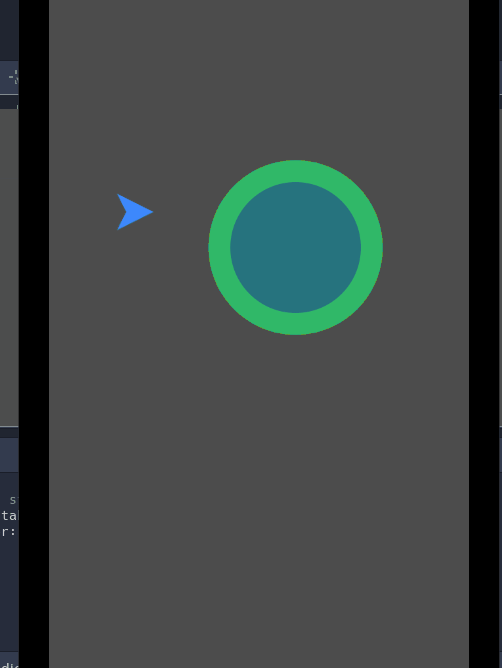
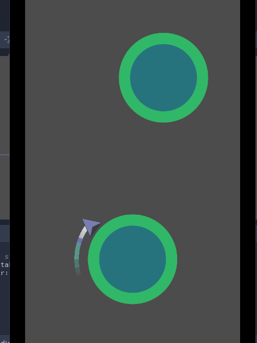

# CircleJump
Trying out Godot from the tutorial by **[KidsCanCode](https://www.youtube.com/channel/UCNaPQ5uLX5iIEHUCLmfAgKg)** 

**Youtube Playlist** - https://youtu.be/wU6otgwaNQg

## Initial setup

* Goto Project -> Project Settings
* Goto submenu Window 
	* Width -> 480 Height -> 854 
	* Orientation -> Portrait
	* Aspect -> keep
* Goto Submenu Pointing -> Emulate touch from mouse

## Results

**Video 1**

**Video 2**

